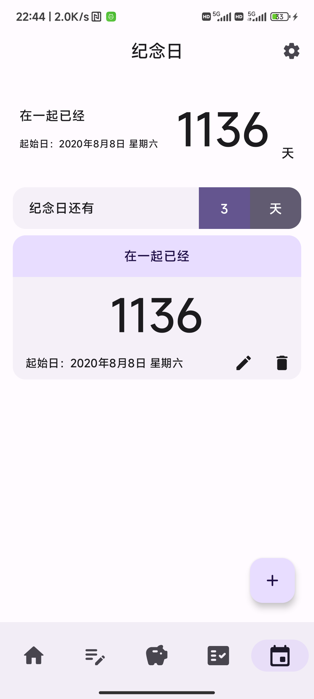

# LittleGooseOfficial

This project was originally started as my graduation design in college. The code is still a bit rough, but it is my first relatively complete project. I will continue to improve and maintain this open-source project in the future.

I am the product manager, designer, and developer of this project. Due to my limited ability, you may see the shadow of many other software in this project. If you have any suggestions, please feel free to submit an issue.

I will put all my knowledge into practice in this project, including interaction design, UI design, motion design, and programming.

I strive for the best practices in all areas. The project is constantly being refactored. Therefore, if you see the code in the blog is inconsistent with the code in the project, please contact me to modify the blog content, or go to the /ver/xml branch to view the code from the previous stage. The code was placed in this branch before the most recent major refactoring.

Project introduction:

- https://juejin.cn/post/7132853501402546184/
- https://juejin.cn/post/7219862257644961849/

### UI design software:

- Figma, icons from Material Icons.

### Libraries used:

- Jetpack Compose
- Room
- Jetpack DataStore
- Hilt
- Kotlin Coroutine
- Kotlin Flow
- SplashScreen
- MPAndroidChart —— https://github.com/PhilJay/MPAndroidChart
- Compose Calendar —— https://github.com/kizitonwose/Calendar
- Markdown Renderer —— https://github.com/mikepenz/multiplatform-markdown-renderer

## Simple use

<p align="center">
  
</p>

The APP is divided into four modules, namely bookkeeping, notes, calendars and anniversaries. There is also a calendar home page, analysis, search function based on this.

## Index

<p align="center">
  
</p>

## Account

<p align="center">
  
</p>

## Markdown Notebook

<p align="center">
  
</p>

## Memorial

<p align="center">
  
</p>

## Search

<p align="center">
  
</p>

## Analysis

<p align="center">
  
</p>

# Contribute

Supported by [Jetbrains](https://jb.gg/OpenSourceSupport).


# License
```
MIT License

Copyright (c) [2023] [MReP1]

Permission is hereby granted, free of charge, to any person obtaining a copy
of this software and associated documentation files (the "Software"), to deal
in the Software without restriction, including without limitation the rights
to use, copy, modify, merge, publish, distribute, sublicense, and/or sell
copies of the Software, and to permit persons to whom the Software is
furnished to do so, subject to the following conditions:

The above copyright notice and this permission notice shall be included in all
copies or substantial portions of the Software.

THE SOFTWARE IS PROVIDED "AS IS", WITHOUT WARRANTY OF ANY KIND, EXPRESS OR
IMPLIED, INCLUDING BUT NOT LIMITED TO THE WARRANTIES OF MERCHANTABILITY,
FITNESS FOR A PARTICULAR PURPOSE AND NONINFRINGEMENT. IN NO EVENT SHALL THE
AUTHORS OR COPYRIGHT HOLDERS BE LIABLE FOR ANY CLAIM, DAMAGES OR OTHER
LIABILITY, WHETHER IN AN ACTION OF CONTRACT, TORT OR OTHERWISE, ARISING FROM,
OUT OF OR IN CONNECTION WITH THE SOFTWARE OR THE USE OR OTHER DEALINGS IN THE
SOFTWARE.
```